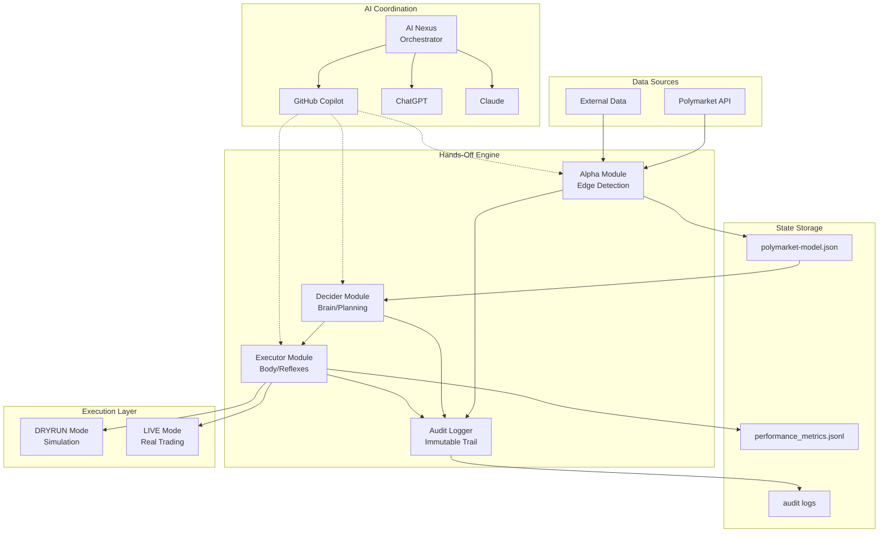
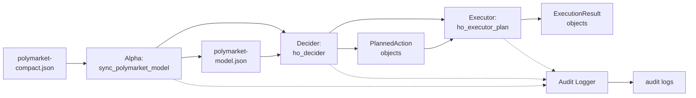
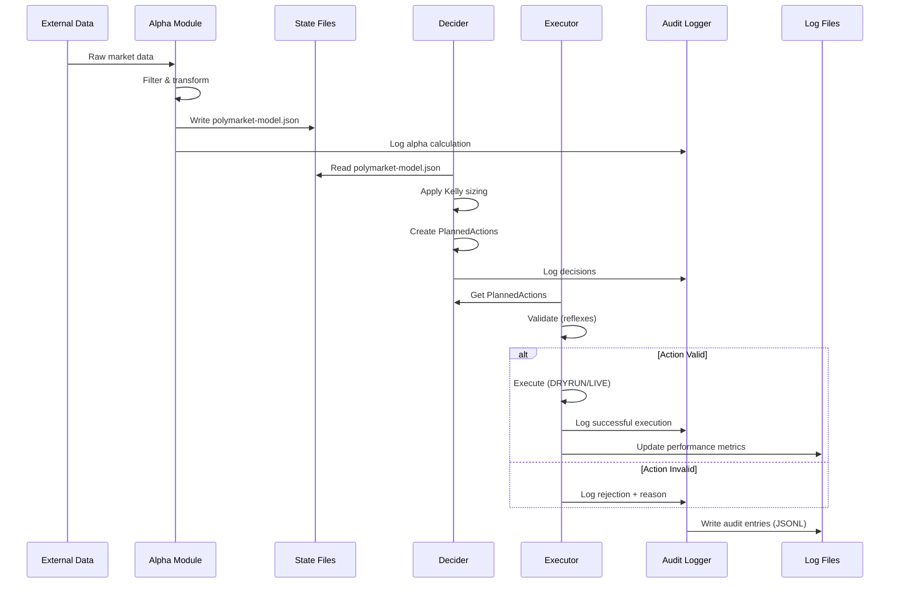
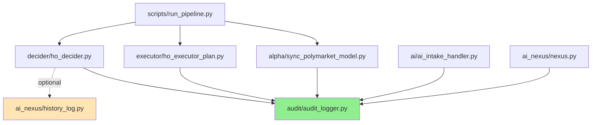
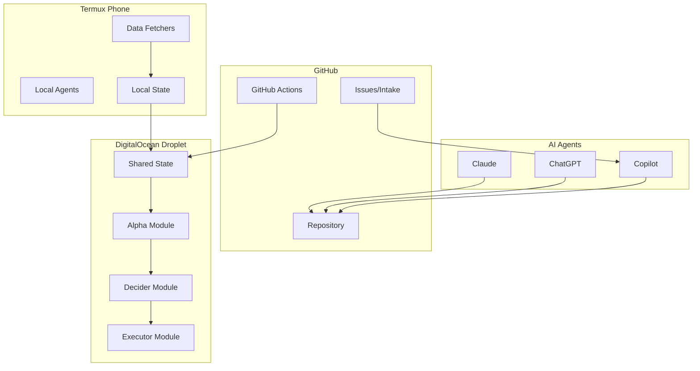
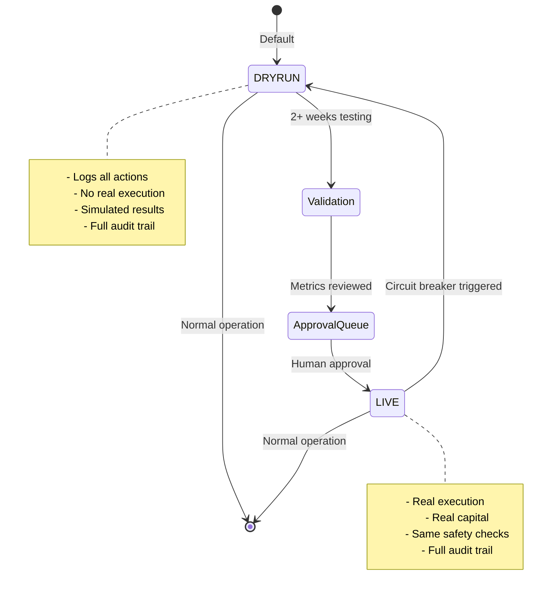
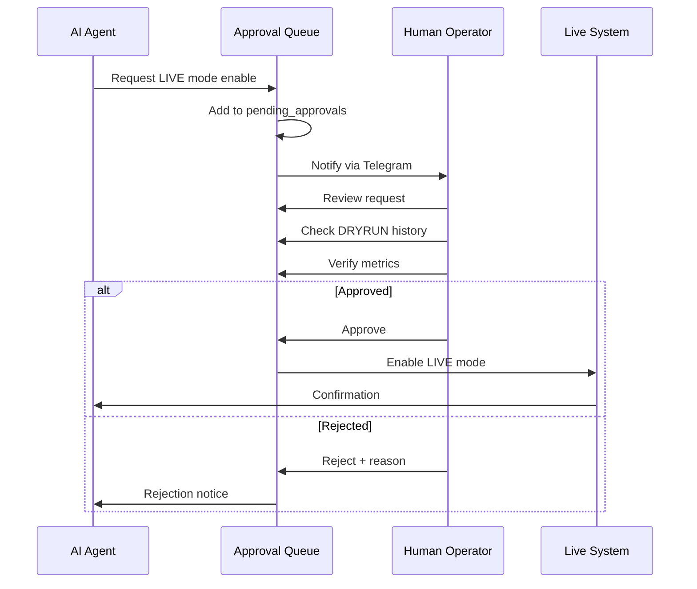

# Architecture

System architecture documentation for the Hands-Off Engine, including component diagrams, data flow, and integration points.

## Table of Contents

1. [System Overview](#system-overview)
2. [Component Architecture](#component-architecture)
3. [Data Flow](#data-flow)
4. [Module Dependencies](#module-dependencies)
5. [Deployment Architecture](#deployment-architecture)
6. [Integration Points](#integration-points)
7. [Security Architecture](#security-architecture)

---

## System Overview

The Hands-Off Engine is a multi-node, multi-agent system for automated trading with strong safety controls.

### High-Level Architecture



### Design Philosophy

1. **Brain-Body-Reflexes Model**:
   - **Brain (Decider)**: Strategic planning and decision-making
   - **Body (Executor)**: Action execution
   - **Reflexes (Executor Validation)**: Instant safety checks

2. **Multi-Layer Safety**:
   - Layer 1: Alpha filtering (edge thresholds)
   - Layer 2: Decider constraints (Kelly sizing caps)
   - Layer 3: Executor reflexes (confidence, size validation)
   - Layer 4: Circuit breakers (daily limits)

3. **DRYRUN-First**:
   - Default mode is simulation
   - LIVE mode requires explicit approval
   - Extensive validation before real capital

---

## Component Architecture

### Core Pipeline Components



#### Alpha Module

**Responsibility**: Transform raw market data into actionable alpha signals.

**Input**: `termux-hands-off/out/polymarket-compact.json`

**Output**: `state/polymarket-model.json`

**Key Functions**:
- Market data ingestion
- Fair price estimation
- Edge calculation
- Confidence scoring
- Market filtering (edge > 5%, price 0.05-0.95)

**Implementation**: `alpha/sync_polymarket_model.py`

#### Decider Module

**Responsibility**: Convert alpha signals into structured planned actions.

**Input**: `state/polymarket-model.json`

**Output**: List of `PlannedAction` objects

**Key Functions**:
- Signal loading and parsing
- Position sizing (Kelly criterion)
- Risk constraint application
- Action planning with reasoning

**Implementation**: `decider/ho_decider.py`

**Position Sizing Formula**:
```
kelly_fraction = edge × confidence
size_fraction = min(kelly_fraction, 0.10)  # Cap at 10%
amount = bankroll × size_fraction
amount = min(amount, MAX_POSITION_SIZE)    # Cap at $100
```

#### Executor Module

**Responsibility**: Validate and execute planned actions with safety checks.

**Input**: List of `PlannedAction` objects

**Output**: List of `ExecutionResult` objects

**Key Functions**:
- Action validation (reflexes)
- Confidence threshold enforcement (≥70%)
- Position size limits (≤$100)
- DRYRUN/LIVE mode switching
- Execution summary generation

**Implementation**: `executor/ho_executor_plan.py`

**Safety Checks**:
1. Confidence ≥ 70%
2. Amount ≤ $100
3. Side ∈ {YES, NO}
4. DRYRUN enforced by default

---

### Supporting Components

#### Audit Logger

**Responsibility**: Provide immutable audit trail for all operations.

**Implementation**: `audit/audit_logger.py`

**Features**:
- Structured JSONL logging
- Daily log rotation
- Multiple event types
- Session tracking
- Graceful degradation (stderr fallback)

**Event Types**:
- Decision events
- Action events
- Data fetch events
- Edge detection events
- Order placement events
- State change events
- Error events

#### AI Nexus

**Responsibility**: Orchestrate multiple AI agents for complex tasks.

**Implementation**: `ai_nexus/nexus.py`

**Features**:
- Multi-provider support (Copilot, ChatGPT, Claude)
- Task prioritization
- Cost tracking
- Token usage monitoring
- Session management

**Components**:
- `AITask`: Task representation
- `AIResult`: Execution result
- `AIProvider`: Provider enum
- `TaskPriority`: Priority levels
- `TaskStatus`: Status tracking

#### AI Intake Handler

**Responsibility**: Handle commands from GitHub issues.

**Implementation**: `ai/ai_intake_handler.py`

**Supported Commands**:
- `/plan`: Generate implementation plan

**Features**:
- GitHub API integration
- OpenAI-based planning
- Policy-aware responses
- Audit logging

---

## Data Flow

### Complete Pipeline Flow



### Data Transformation Pipeline

```
┌─────────────────────────────────────────────────────────────────┐
│                     RAW MARKET DATA                             │
│  {slug, question, last, bestBid, bestAsk, liquidity}            │
└────────────────────────┬────────────────────────────────────────┘
                         │
                         ▼
            ┌────────────────────────┐
            │   ALPHA PROCESSING     │
            │  - Estimate fair price │
            │  - Calculate edge      │
            │  - Score confidence    │
            │  - Filter by thresholds│
            └────────────┬───────────┘
                         │
                         ▼
┌─────────────────────────────────────────────────────────────────┐
│                   ALPHA SIGNALS                                 │
│  {market_id, side, model_edge, model_confidence, fair_price}   │
└────────────────────────┬────────────────────────────────────────┘
                         │
                         ▼
            ┌────────────────────────┐
            │   DECISION LOGIC       │
            │  - Load signals        │
            │  - Apply Kelly sizing  │
            │  - Cap at 10% bankroll │
            │  - Generate reasoning  │
            └────────────┬───────────┘
                         │
                         ▼
┌─────────────────────────────────────────────────────────────────┐
│                 PLANNED ACTIONS                                 │
│  {market_id, side, amount, confidence, reasoning}               │
└────────────────────────┬────────────────────────────────────────┘
                         │
                         ▼
            ┌────────────────────────┐
            │  VALIDATION (REFLEXES) │
            │  - Check confidence    │
            │  - Check size limits   │
            │  - Validate side       │
            └────────────┬───────────┘
                         │
                    ┌────┴────┐
                    │         │
                 Valid?     Invalid
                    │         │
                    ▼         ▼
              ┌─────────┐  ┌──────────┐
              │ Execute │  │  Reject  │
              └─────────┘  └──────────┘
                    │         │
                    └────┬────┘
                         ▼
┌─────────────────────────────────────────────────────────────────┐
│                 EXECUTION RESULTS                               │
│  {market_id, success, message, executed_amount}                 │
└─────────────────────────────────────────────────────────────────┘
```

---

## Module Dependencies

### Dependency Graph



**Legend**:
- Solid lines: Required dependencies
- Dashed lines: Optional dependencies
- Green: Core infrastructure (Audit)
- Tan: Optional components (History)

### Import Structure

```python
# Core Pipeline
scripts/run_pipeline.py
├── alpha.sync_polymarket_model
├── decider.ho_decider
│   └── audit (via get_audit_logger)
└── executor.ho_executor_plan
    └── audit (via get_audit_logger)

# AI Systems
ai/ai_intake_handler.py
└── audit (via get_audit_logger)

ai_nexus/nexus.py
└── audit (via get_audit_logger)

# Audit has NO dependencies (foundational)
audit/audit_logger.py
└── (stdlib only: json, os, time, datetime, pathlib)
```

### Circular Dependency Prevention

**Rule**: Audit module has zero dependencies on other project modules.

**Rationale**: 
- Audit is foundational infrastructure
- Must be available to all components
- Cannot create circular imports
- Graceful degradation if unavailable

**Pattern**:
```python
# All modules import audit
from audit import get_audit_logger

# Audit never imports from project modules
# (only stdlib imports)
```

---

## Deployment Architecture

### Multi-Node Setup



### Communication Channels

| Channel | Usage % | Purpose | Priority |
|---------|---------|---------|----------|
| Telegram | 99% | Routine operations, notifications | High |
| GitHub Issues | ~1% | Strategic planning via `/plan` | Medium |
| CLI | <1% | Emergency access only | Critical |

### State Synchronization

```
Termux Phone (Local)
      ↓ (rsync/sftp)
DigitalOcean Droplet (Shared State)
      ↓ (git push)
GitHub Repository (Source of Truth)
      ↓ (git pull)
Developer Machines / AI Agents
```

---

## Integration Points

### External Systems

#### Polymarket API (Conceptual)

**Purpose**: Fetch market data and place orders

**Endpoints**:
- `GET /markets`: List markets
- `GET /markets/{id}`: Get market details
- `POST /orders`: Place order

**Authentication**: API key (not implemented yet)

**Rate Limits**: TBD

#### Telegram Bot

**Purpose**: User interface and notifications

**Implementation**: `telegram/telegram_bot_listener.py`

**Features**:
- Command interface
- Notification delivery
- Status updates
- Emergency controls

#### GitHub API

**Purpose**: Issue management and code updates

**Implementation**: `ai/ai_intake_handler.py`

**Features**:
- Issue comment monitoring
- Command processing (`/plan`)
- Response posting
- Audit logging

### Internal Integrations

#### State File Coordination

```python
# Writing state (atomic)
output_tmp = output_path.with_suffix('.tmp')
with open(output_tmp, 'w') as f:
    json.dump(data, f, indent=2)
output_tmp.replace(output_path)  # Atomic on Unix

# Reading state
with open(input_path, 'r') as f:
    data = json.load(f)
```

#### Audit Trail Integration

```python
# Every module logs to audit
from audit import get_audit_logger

audit = get_audit_logger(component="my_module")

# Log critical operations
audit.log_decision(...)
audit.log_action(...)
audit.log_edge_detection(...)
```

#### AI Agent Coordination

```python
# Post message for other agents
message = {
    "from_agent": "copilot",
    "to_agent": "chatgpt",
    "message_type": "task_handoff",
    "content": {...}
}

with open('ai/coordination/messages.jsonl', 'a') as f:
    f.write(json.dumps(message) + '\n')
```

---

## Security Architecture

### Safety Layers

```
┌─────────────────────────────────────────────────────┐
│              LAYER 4: Circuit Breakers              │
│  - Daily loss limit (-$200)                         │
│  - Max daily positions (20)                         │
│  - Max daily risk ($500)                            │
└──────────────────────┬──────────────────────────────┘
                       │
┌──────────────────────▼──────────────────────────────┐
│         LAYER 3: Executor Validation (Reflexes)     │
│  - Confidence threshold (≥70%)                      │
│  - Position size check (≤$100)                      │
│  - Side validation (YES/NO only)                    │
│  - DRYRUN enforcement                               │
└──────────────────────┬──────────────────────────────┘
                       │
┌──────────────────────▼──────────────────────────────┐
│           LAYER 2: Decider Constraints              │
│  - Kelly fraction cap (10%)                         │
│  - Max position size ($100)                         │
│  - Reasoning required                               │
└──────────────────────┬──────────────────────────────┘
                       │
┌──────────────────────▼──────────────────────────────┐
│          LAYER 1: Alpha Model Filtering             │
│  - Min edge threshold (5%)                          │
│  - Price boundaries (0.05-0.95)                     │
│  - Confidence scoring                               │
└─────────────────────────────────────────────────────┘
```

### DRYRUN vs LIVE Mode



### Approval Workflow



### Audit Trail Security

**Properties**:
- **Immutable**: Append-only JSONL files
- **Timestamped**: ISO 8601 + Unix timestamps
- **Structured**: Consistent JSON schema
- **Session-tracked**: All related events grouped
- **Recoverable**: Can reconstruct state from logs

**Access Control**:
- Audit files: Read-only after creation
- State files: Write with atomic operations
- Configuration: Manual updates only

---

## Performance Characteristics

### Latency Budget

| Component | Expected Latency | Notes |
|-----------|------------------|-------|
| Alpha sync | 1-5 seconds | File I/O dominant |
| Decider planning | <100ms | Pure computation |
| Executor validation | <10ms | Rule checks only |
| Executor execution (DRYRUN) | <50ms | Log writing |
| Executor execution (LIVE) | 1-3 seconds | API calls |
| Audit logging | <5ms | Async disk write |
| Full pipeline | 2-10 seconds | End-to-end |

### Scalability

**Current Scale**:
- Markets analyzed: ~100-1000/run
- Markets selected: ~20/run
- Positions/day: ~20
- Audit events/day: ~1000-10,000

**Design Limits**:
- Max markets/run: ~10,000 (memory bound)
- Max positions/day: 100 (business rule)
- Audit log size: ~10 MB/day
- State file size: ~1 MB

---

## Future Architecture Enhancements

### Planned Improvements (Post-V1)

1. **Distributed Audit**:
   - Multi-node audit aggregation
   - Real-time audit streaming
   - Centralized audit dashboard

2. **Advanced Risk Models**:
   - Correlation-based portfolio limits
   - Dynamic Kelly adjustment
   - Market-specific risk profiles

3. **Real-Time Processing**:
   - WebSocket market data feeds
   - Streaming alpha calculation
   - Sub-second execution pipeline

4. **Multi-Strategy Support**:
   - Pluggable alpha models
   - Strategy backtesting framework
   - A/B testing infrastructure

5. **Enhanced Monitoring**:
   - Real-time dashboards
   - Anomaly detection
   - Performance attribution

---

## References

- [API_REFERENCE.md](API_REFERENCE.md) - Detailed function documentation
- [DATA_SCHEMAS.md](DATA_SCHEMAS.md) - Data structure specifications
- [RISK_MODEL_V1.md](RISK_MODEL_V1.md) - Risk management details
- [DEVELOPER_GUIDE.md](DEVELOPER_GUIDE.md) - Development workflows

---

## Glossary

- **Alpha**: Expected edge or advantage in a trading opportunity
- **Brain**: The Decider module that plans actions
- **Body**: The Executor module that takes actions
- **Reflexes**: Executor's safety validation checks
- **DRYRUN**: Simulation mode with no real trading
- **LIVE**: Production mode with real capital at risk
- **Kelly Criterion**: Mathematical formula for optimal position sizing
- **Circuit Breaker**: Automatic safety mechanism that stops trading
- **Audit Trail**: Immutable log of all system operations
