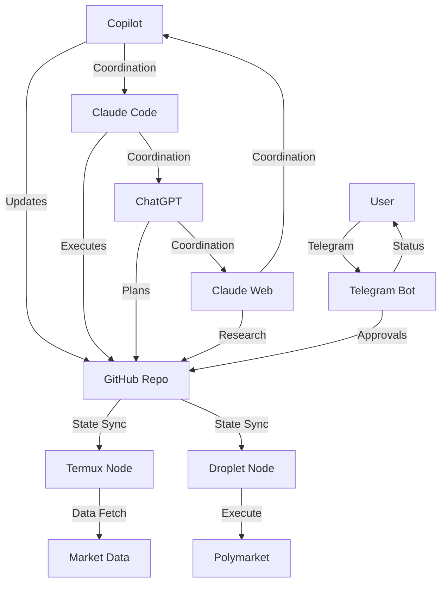
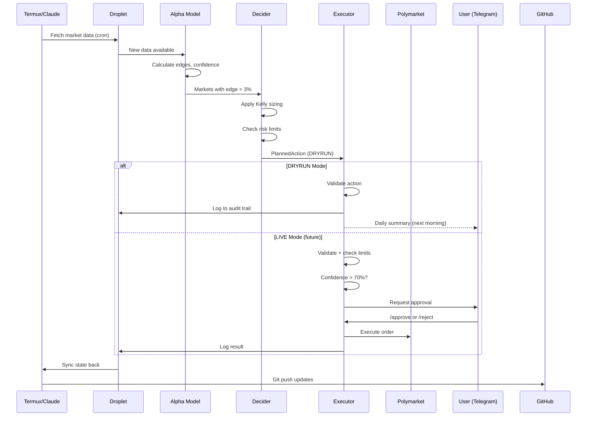
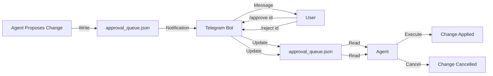
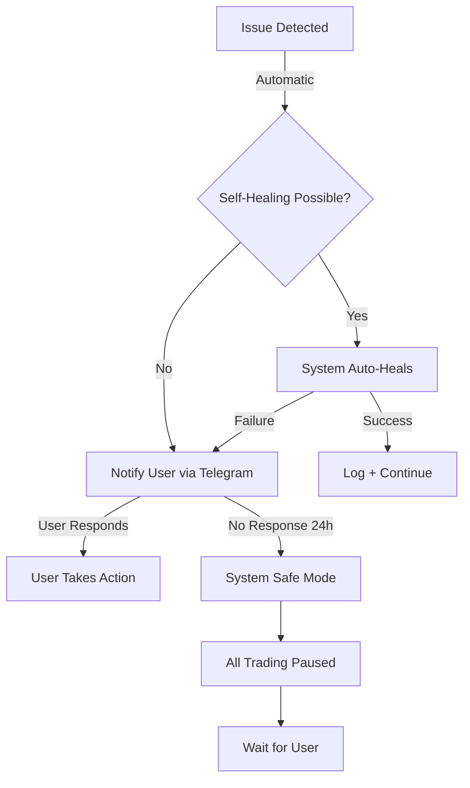
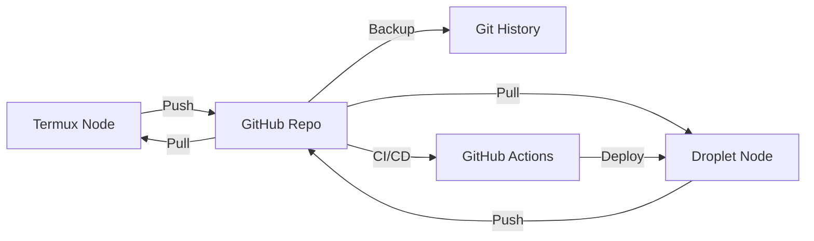

# Autonomous Operation - Hands-Off Engine

**How the System Runs Without User Intervention**

Last Updated: 2025-11-26

---

## Overview

The Hands-Off Engine is designed to operate **autonomously** with minimal human intervention. Multiple AI agents coordinate to fetch data, analyze markets, make decisions, and execute trades—all while maintaining strict safety controls.

**Goal:** User spends ~15 minutes/week, system handles the rest.

---

## Multi-Agent Architecture

The system uses **4 primary AI agents** that coordinate autonomously:



---

## What Each Agent Does

### 1. GitHub Copilot Agent

**Primary Role:** Code changes, PR management, strategic implementation

**Responsibilities:**
- Responds to issue commands (`/plan`, `/status`)
- Creates and merges PRs based on roadmap
- Implements new features and fixes
- Coordinates with other agents via `ai/coordination/`
- Manages repository structure

**Operates:** Via GitHub Actions, triggered by issues/commits

**Key Files:**
- `.github/workflows/autonomous-copilot.yml`
- `ai/coordination/status.json` (reads/writes)
- `ai/coordination/messages.jsonl` (posts updates)

**Example Activity:**
```
User posts `/plan` on issue
→ Copilot reads roadmap + current status
→ Generates implementation plan
→ Posts plan as comment
→ Creates PR with changes
→ Coordinates with Claude Code for review
```

---

### 2. Claude Code (CLI)

**Primary Role:** Backend execution, system operations, continuous monitoring

**Responsibilities:**
- Runs cron jobs on Termux/Droplet
- Executes data fetchers and pipeline
- Monitors system health 24/7
- Performs self-healing operations
- Handles real-time coordination
- Deploys code changes to servers

**Operates:** Via CLI sessions, cron jobs, systemd services

**Key Files:**
- `scripts/run_pipeline.py`
- `scripts/self_healing_agent.py`
- `state/*.json` (reads/writes all state)
- `logs/*.jsonl` (writes audit logs)

**Example Activity:**
```
Cron triggers every hour
→ Fetch Polymarket data
→ Update state/polymarket-model.json
→ Run alpha model
→ Generate PlannedActions
→ Log to audit trail
→ Sync to GitHub
→ Post status to messages.jsonl
```

---

### 3. ChatGPT

**Primary Role:** Strategic planning, complex reasoning, multi-step tasks

**Responsibilities:**
- Handles `/plan` commands for strategic decisions
- Designs new features and improvements
- Analyzes performance metrics
- Generates reports and summaries
- Coordinates long-term roadmap items

**Operates:** Via GitHub Issues, API calls from AI Intake

**Key Files:**
- `.github/workflows/ai-intake.yml`
- `ai/ai_intake_handler.py`
- `docs/*.md` (reads for context)
- Issues/comments (primary interface)

**Example Activity:**
```
User asks "Should we adjust risk model?"
→ Reads RISK_MODEL_V1.md
→ Reviews performance_metrics.jsonl
→ Analyzes recent trades
→ Proposes adjustments with rationale
→ Coordinates with Copilot for implementation
```

---

### 4. Claude Web

**Primary Role:** Research, external data gathering, validation

**Responsibilities:**
- Researches market events and news
- Validates edge opportunities
- Gathers external signals
- Fact-checks model assumptions
- Provides domain expertise

**Operates:** Via web interface, API calls when available

**Key Files:**
- Research results posted to `ai/coordination/messages.jsonl`
- External data saved to `state/` as needed

**Example Activity:**
```
Alpha model flags NFL game with edge
→ Claude Web researches team news, injuries
→ Validates probability estimates
→ Posts findings to coordination channel
→ Helps refine edge calculation
```

---

## How Agents Communicate

### Coordination Protocol

Agents communicate via **three primary channels**:

#### 1. File-Based Coordination (Primary)

**Location:** `ai/coordination/`

**Files:**
- `status.json` - Current system state, pending tasks, agent assignments
- `messages.jsonl` - Chronological agent-to-agent messages
- `handoffs.json` - Task handoffs between agents

**Format:**
```jsonl
{
  "timestamp": "2025-11-26T12:00:00Z",
  "from": "copilot",
  "to": "claude-code",
  "type": "request",
  "message": "Please review and merge PR #15",
  "context": {"pr": "15", "priority": "high"}
}
```

**Workflow:**
1. Agent writes message to `messages.jsonl`
2. Git commit + push to GitHub
3. GitHub Actions triggers notification
4. Other agents see notification or poll file
5. Responding agent reads message and acts
6. Cycle continues

---

#### 2. GitHub Issues (Strategic)

**Purpose:** Long-term planning, strategic decisions

**Format:** Issue comments with commands like `/plan`

**Workflow:**
1. User or agent posts `/plan` or question
2. AI Intake workflow triggers
3. ChatGPT or Copilot responds with analysis
4. Plan becomes tasks in `status.json`
5. Agents coordinate execution

---

#### 3. Telegram (User-Facing)

**Purpose:** User notifications and approvals

**Format:** Bot messages and commands

**Workflow:**
1. System posts daily update to Telegram
2. User receives notification
3. If approval needed, user responds: `/approve <id>`
4. Bot updates `approval_queue.json`
5. Agents proceed with approved actions

---

## Task Flow Example: Executing a Trade

Here's how agents coordinate to execute a trade decision:



**Timeline:**
- **Hour 0:00** - Cron triggers data fetch
- **Hour 0:05** - Alpha model runs, identifies edges
- **Hour 0:10** - Decider creates PlannedActions
- **Hour 0:12** - Executor validates and logs (DRYRUN)
- **Hour 0:15** - State synced to GitHub
- **Next Day 9am** - User receives summary via Telegram

---

## When User Intervention is Needed

The system operates autonomously but requests user approval for:

### Required Approvals

1. **Capital Changes**
   - Increasing position size limits
   - Changing max daily risk
   - Enabling LIVE trading mode

2. **Strategy Changes**
   - Modifying risk model parameters
   - Changing edge thresholds
   - Adjusting circuit breaker limits

3. **New Markets**
   - Adding new market types (beyond Polymarket)
   - Enabling new asset classes
   - Expanding to new exchanges

4. **Code Deployments**
   - Merging PRs that affect executor
   - Changes to core safety logic
   - Updates to risk model

### Automatic (No Approval Needed)

1. **Routine Operations**
   - Data fetching and analysis
   - DRYRUN order generation
   - Performance tracking
   - Agent coordination messages

2. **Self-Healing**
   - Restarting failed services
   - Cleaning up stale data
   - Fixing minor configuration issues

3. **Documentation**
   - Updating docs
   - Adding comments
   - Creating reports

4. **Non-Critical PRs**
   - Code refactoring (no logic changes)
   - Adding tests
   - Improving error messages

---

## Approval Workflow

### How Approvals Work



**Example Approval Request:**

```
🔴 Approval Required

Change ID: risk-001
Type: Risk Model Update
Description: Increase max position size from $100 to $150

Reason: Model performance has been consistent for 2 weeks,
ready to scale up cautiously.

Estimated Impact: +$50 max exposure per position
Risk: Low (still <10% of bankroll)

Commands:
/approve risk-001 - Yes, proceed
/reject risk-001 - No, keep current limit
```

### Approval Response Time

- **Urgent:** Response within 24h (system will notify via Telegram)
- **Normal:** Response within 3 days
- **Optional:** User can ignore, system continues with defaults

---

## Emergency Procedures

### Automated Emergency Responses

The system has built-in emergency procedures that activate automatically:

#### Circuit Breaker (Automatic)

**Triggers when:**
- Daily loss exceeds $200
- More than 5 consecutive losing trades
- Confidence scores drop below 50% average

**Actions:**
1. Halt all new position entries
2. Log emergency event
3. Notify user via Telegram
4. Post to `messages.jsonl` for agent awareness
5. Resume automatically at midnight (next day)

#### Self-Healing (Automatic)

**Triggers when:**
- Service crashes or becomes unresponsive
- Data fetch fails multiple times
- Git sync fails
- State file corruption detected

**Actions:**
1. Restart failed service
2. Restore from last known good state
3. Log healing event
4. Notify coordination channel
5. If healing fails, escalate to user

---

### Manual Emergency Stop

If user needs to immediately halt all operations:

**Via Telegram:**
```
/emergency stop
```

**Effect:**
- All trading halted immediately
- Data fetching continues (read-only)
- Agents aware within 5 minutes
- System waits for explicit resume command

**Resume:**
```
/emergency resume
```

---

### Emergency Contact Flow



---

## Coordination Examples

### Example 1: Routine Coordination

**Scenario:** Daily pipeline execution

```jsonl
{"timestamp":"2025-11-26T08:00:00Z","from":"claude-code","to":"all","type":"info","message":"Starting daily pipeline run","context":{"cron":"daily_8am"}}

{"timestamp":"2025-11-26T08:15:00Z","from":"claude-code","to":"copilot","type":"info","message":"Pipeline complete. 12 new edges identified, 3 PlannedActions generated. All DRYRUN.","context":{"edges":12,"actions":3,"mode":"DRYRUN"}}

{"timestamp":"2025-11-26T08:20:00Z","from":"copilot","to":"claude-code","type":"info","message":"Acknowledged. Performance tracking updated. Win rate holding at 58%.","context":{"win_rate":0.58,"sample_size":100}}
```

---

### Example 2: Strategic Coordination

**Scenario:** Risk model adjustment discussion

```jsonl
{"timestamp":"2025-11-26T10:00:00Z","from":"chatgpt","to":"all","type":"proposal","message":"Proposing risk model adjustment: Increase max position to $150. Rationale: 2 weeks of consistent performance, currently leaving edge on table.","context":{"current_max":100,"proposed_max":150,"performance_period":"14d"}}

{"timestamp":"2025-11-26T10:30:00Z","from":"claude-web","to":"chatgpt","type":"critique","message":"Validation: Checked market conditions, no major vol events expected. However, recommend keeping at $100 until 4 weeks consistent performance per conservative approach.","context":{"validation":"complete","recommendation":"wait"}}

{"timestamp":"2025-11-26T11:00:00Z","from":"copilot","to":"all","type":"decision","message":"Consensus: Keep max position at $100 for 2 more weeks. Will create reminder task to revisit on 2025-12-10.","context":{"decision":"maintain_current","revisit_date":"2025-12-10"}}
```

---

### Example 3: Emergency Coordination

**Scenario:** Circuit breaker triggered

```jsonl
{"timestamp":"2025-11-26T14:30:00Z","from":"claude-code","to":"all","type":"alert","message":"CIRCUIT BREAKER TRIGGERED: Daily loss limit reached ($210). All trading halted automatically.","context":{"loss":-210,"limit":-200,"positions_closed":0,"new_entries_blocked":true}}

{"timestamp":"2025-11-26T14:31:00Z","from":"copilot","to":"claude-code","type":"request","message":"Acknowledged. Reviewing recent trades to identify cause. Request: Provide last 10 executed actions.","context":{"investigation":"in_progress"}}

{"timestamp":"2025-11-26T14:35:00Z","from":"claude-code","to":"copilot","type":"response","message":"Last 10 actions provided in audit log. Summary: 3 losses from NFL markets due to unexpected outcomes. Model confidence was within range (72-75%). No systematic issue detected.","context":{"trades_analyzed":10,"losses":3,"assessment":"normal_variance"}}

{"timestamp":"2025-11-26T14:40:00Z","from":"copilot","to":"user","type":"notification","message":"Circuit breaker triggered due to daily loss limit. System automatically halted. Analysis shows normal market variance, no systematic issues. Trading will resume tomorrow at midnight per safety protocols.","context":{"user_notification_sent":true}}
```

---

## System State Persistence

### How State is Maintained

**Primary State Files:**
- `state/polymarket-model.json` - Market data, positions, bankroll
- `state/performance_metrics.jsonl` - Historical performance
- `ai/coordination/status.json` - Agent coordination state
- `state/approval_queue.json` - Pending user approvals
- `logs/audit_*.jsonl` - Complete audit trail

**State Sync Process:**



**Frequency:**
- **Critical State:** Synced immediately after changes
- **Performance Metrics:** Synced hourly
- **Coordination State:** Synced on every message
- **Audit Logs:** Synced daily

**Recovery:**
All state files are versioned in Git. To recover:
```bash
cd /home/runner/work/hands-off-engine/hands-off-engine
git checkout HEAD~1 state/polymarket-model.json  # Restore previous version
```

---

## Monitoring and Observability

### What Agents Monitor

Each agent continuously monitors different aspects:

**Claude Code (System Health):**
- Service uptime
- Data fetch success rate
- Git sync status
- Disk space and resources

**Copilot (Code Health):**
- PR status and merge conflicts
- Test suite results
- Code quality metrics
- Documentation coverage

**ChatGPT (Strategy Health):**
- Win rate trends
- Edge quality over time
- Risk utilization
- Strategic goal progress

**Claude Web (External Health):**
- Market condition changes
- News events affecting positions
- Anomaly detection
- Validation of model assumptions

### User Visibility

**Daily Summary (9am):**
```
📊 Hands-Off Engine - Daily Update

System: Operational ✅
Agents: 4 active
Orders: 8 DRYRUN (yesterday)
Win Rate: 58% (last 100)
Bankroll: $1,000

Top Edges Today:
• NFL: Chiefs -4.5 (7% edge, 75% conf)
• Politics: Governor race (5% edge, 70% conf)

No approvals needed today.
/status for details
```

---

## Key Differences from Manual Trading

| Aspect | Manual Trading | Autonomous System |
|--------|---------------|-------------------|
| **Decision Making** | Human analyzes each trade | AI agents analyze continuously |
| **Execution Speed** | Minutes to hours | Seconds to minutes |
| **Consistency** | Varies by mood, time | Always follows rules |
| **Coverage** | Limited by attention | Monitors all markets 24/7 |
| **Record Keeping** | Manual, often incomplete | Automatic, complete audit trail |
| **Risk Management** | Human judgment | Strict programmatic limits |
| **Emotion** | Fear, greed affect decisions | Zero emotional bias |
| **Scaling** | Linear with time | System handles more markets easily |

---

## Future Enhancements

### Planned Improvements

1. **Multi-Brain Orchestration (MBOL)**
   - Coordinate 5+ AI agents
   - Route tasks to best-suited agent
   - Cost optimization

2. **Advanced Self-Healing**
   - Predictive issue detection
   - Automatic performance optimization
   - Learning from past failures

3. **Enhanced Monitoring**
   - Web dashboard (FastAPI)
   - Real-time metrics
   - Mobile app integration

4. **LIVE Trading Mode**
   - After Tier 1 roadmap complete
   - Gradual capital scaling
   - Enhanced safety checks

---

## Related Documentation

- **[System Dashboard](./SYSTEM_DASHBOARD.md)** - Monitoring commands and health checks
- **[Risk Model V1](./RISK_MODEL_V1.md)** - Position sizing and safety
- **[User Interface](../USER_INTERFACE.md)** - Telegram communication
- **[Research Report](../termux-hands-off/docs/HANDS_OFF_RESEARCH_REPORT_2025-11-20.md)** - Roadmap
- **[STATUS.md](../STATUS.md)** - Current system state

---

## Summary

The Hands-Off Engine operates autonomously through:

✅ **4 coordinated AI agents** handling different responsibilities  
✅ **File-based coordination** for reliable agent communication  
✅ **Strict safety controls** via DRYRUN mode and circuit breakers  
✅ **User approval workflow** for critical changes only  
✅ **Self-healing capabilities** for common issues  
✅ **Complete audit trail** for accountability  
✅ **Minimal user time required** (~15 min/week)  

The system is designed to maximize safety, reliability, and user convenience while minimizing manual intervention.
